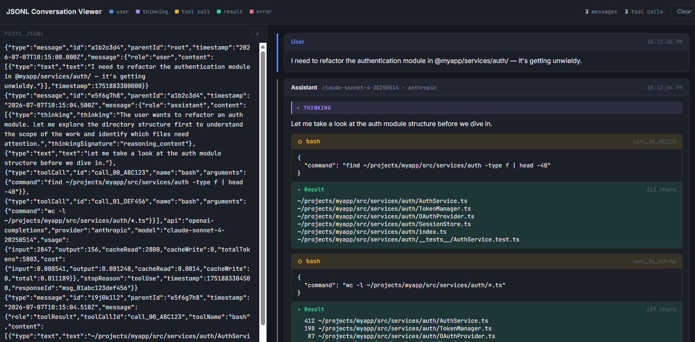

# JSONL Conversation Viewer

A dark-themed, single-page browser app for viewing **JSONL conversation logs** — traces from AI coding agents with user messages, assistant replies, tool calls, tool results, and thinking blocks.



## Features

- **Paste & render** — paste JSONL anywhere in the left pane; renders instantly with a 120ms debounce
- **Comments** — lines starting with `//` or `#` are ignored by the parser, so you can annotate your JSONL inline
- **Tool call nesting** — tool results are nested under their matching tool calls (matched by `toolCallId`)
- **Orphan results** — unmatched tool results render as standalone error rows
- **Stats bar** — live counts: messages, tool calls, errors, parse errors
- **Collapsible input pane** — fold the left pane for full-width conversation reading
- **History drawer** — auto-saves a draft as you type; manually save entries for later recall
- **Keyboard shortcuts** — `Ctrl+S` saves to history, `Ctrl+Shift+H` toggles the history drawer
- **Download** — one-click download of the current input as a `.jsonl` file
- **Thinking blocks** — collapsible `<details>` sections for reasoning traces
- **Usage footers** — token counts, cache reads, cost, and stop reason per assistant message
- **Responsive** — stacks vertically on narrow viewports (<860px)

## JSONL Format

**Comments:** Lines starting with `//` or `#` are ignored — use them to annotate your traces inline.

Each data line must be valid JSON with a `message` field:

```jsonl
{"type":"message","id":"...","message":{"role":"user","content":[{"type":"text","text":"Hello"}]}}
{"type":"message","id":"...","message":{"role":"assistant","content":[...],"model":"...","provider":"...","usage":{...},"stopReason":"..."}}
{"type":"message","id":"...","message":{"role":"toolResult","toolCallId":"call_00_...","toolName":"bash","content":[{"type":"text","text":"..."}],"isError":false}}
```

The viewer supports the `role` values: `user`, `assistant`, `toolResult`.

Content blocks inside `assistant` messages can be:
- `{"type":"text","text":"..."}`
- `{"type":"thinking","thinking":"..."}`
- `{"type":"toolCall","id":"...","name":"...","arguments":{...}}`

## Development

**Prerequisites:** [Bun](https://bun.sh) ≥ 1.0

```bash
# Start dev server with live-reload
bun run dev

# Production build → dist/index.html
bun run build

# Serve production build locally
bun run serve

# Run tests
bun test
```

## Docker

```bash
# Build image
docker build -t jsonl-viewer .

# Run container
docker run -p 3000:3000 jsonl-viewer
```

Open http://localhost:3000.

Multi-stage build: compiles in `oven/bun:1`, runs in `oven/bun:1-slim` (~80 MB final image).

## Deploy on Coolify

1. In your Coolify dashboard, create a **New Service** and select your Git source (GitHub, GitLab, etc.)
2. Point it to your fork or https://github.com/defmans7/jsonl-conversation-viewer
3. Set the **Build Pack** to **Dockerfile** (Coolify auto-detects the Dockerfile at the repo root)
4. Under **Domains**, add a domain or use a Coolify-generated URL
5. Set the **Ports** mapping to `3000` (or leave the `PORT` environment variable default at 3000)
6. Click **Deploy** — Coolify builds the Dockerfile and serves the app

No environment variables are required. If you need to change the port, set `PORT` to your desired value.

## Project Structure

```
src/
├── app.js              # Entry point — DOM wiring, events, keybindings, render pipeline
├── history.js          # History persistence — localStorage read/write, draft auto-save
├── index.html          # HTML shell (dev: loads modules, prod: inlined)
├── renderer.js         # All render functions (message rows, tool blocks, stats)
├── lib/
│   ├── parser.js       # JSONL parser (with comment support) + SAMPLE data
│   └── utils.js        # escapeHtml, fmtTime, fmtMoney
├── styles/
│   └── main.css        # All styles (CSS custom properties, dark theme, responsive)
└── __tests__/
    ├── parser.test.js   # 10 tests — parsing, comments, errors, nested JSON
    └── utils.test.js    # 15 tests — HTML escaping, time formatting, money formatting
build.js                # Bun build — bundles + inlines → dist/index.html
serve.js                # Dev server with live-reload
serve.prod.js           # Production static server
Dockerfile              # Multi-stage Docker build
```

## License

MIT
